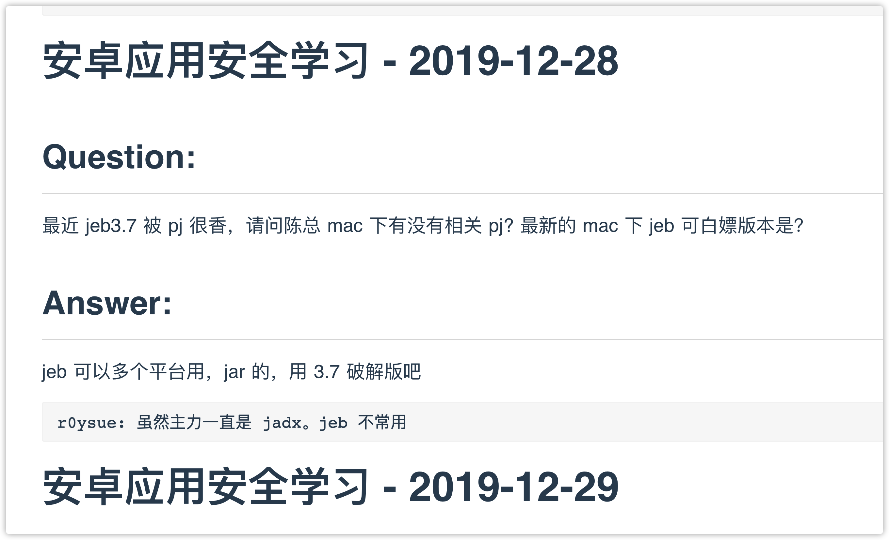

# 知识星球生成 MarkDown 文件

## 安装依赖

```bash
pip3 install -r requirements.txt -i https://pypi.tuna.tsinghua.edu.cn/simple
```

## 使用方法

> 修改 main.py 中的 cookies 以及 要爬取的 group_id

```python
class ZsxqSpider(object):
    def __init__(self):
        self.group_id = "15xxxxxxxxx812"       # 修改成你要爬取的 Group ID
        self.cookies = {
            "UM_distinctid": "******",
            "abtest_env": "product",
            "zsxq_access_token": "******",
            "sajssdk_2015_cross_new_user": "1",
            "sensorsdata2015jssdkcross": "******",
        }
```

直接运行即可。

```bash
python3 main.py
```

## 效果


